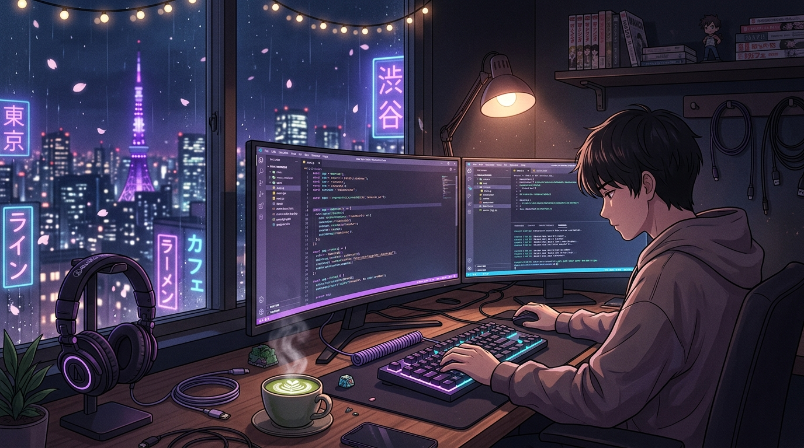

<!--
  ========================================================================
  🌸 ADITYA SHARMA (@adisharma9548) - ANIME / LO-FI DEV GITHUB PROFILE 🌸
  ========================================================================
-->

<div align="center">

  <!-- Header Banner -->
  <a href="https://github.com/adisharma9548">
    
  </a>

  <br/><br/>

  <!-- Dynamic Typing Title -->
  <a href="https://github.com/adisharma9548">
    
  </a>

  <br/>

  <!-- Profile Badges & Stats Highlights -->
  <p align="center">
    
    
    
  </p>

  <!-- Quick Social Pill Links -->
  <p align="center">
    <a href="https://github.com/adisharma9548" target="_blank" rel="noopener">
      
    </a>
    <a href="https://www.linkedin.com/in/aditya-sharma-479647298" target="_blank" rel="noopener">
      
    </a>
    <a href="https://leetcode.com/u/theAdityaCoder/" target="_blank" rel="noopener">
      
    </a>
    <a href="https://x.com/AdityaS78238004" target="_blank" rel="noopener">
      
    </a>
    <a href="https://discordapp.com/users/1111480590118703175" target="_blank" rel="noopener">
      
    </a>
    <a href="mailto:adisharma9548@gmail.com" target="_blank" rel="noopener">
      
    </a>
  </p>

</div>

---

### 🌸 About Me

```yaml
coder:
  name: Aditya Sharma
  aliases: ["theAdityaCoder", "adisharma9548"]
  role: Full-Stack Engineer & Creative Technologist
  vibe: "Anime enthusiast, lo-fi listener, terminal dweller"
  loves: ["Clean Code", "Glassmorphic UIs", "Matcha Latte", "Cyber-aesthetic Systems"]
  current_quest: "Engineering buttery-smooth web apps & intelligent microservices"
```

- 🔭 **Currently Building**: Aesthetic high-impact web platforms, full-stack architectures, and AI-assisted workflows.
- 🌱 **Learning & Exploring**: Advanced System Architecture, Distributed Workflows, and WebGL / Canvas interactive UI.
- 💬 **Ask Me About**: React, TypeScript, Node.js, Python, Tailwind CSS, API Architecture, Algorithms, and UI/UX design.
- 🎧 **Coding Playlist**: Lo-Fi Hip Hop Beats, Synthwave, and Anime OSTs on repeat.
- ⚡ **Fun Fact**: *I write bug-free code whenever the lo-fi beat drops just right.*

---

### 🎮 Contribution Grid: The Snake Game

<!-- Animated Snake eating contribution graph (Generated via GitHub Action) -->
<div align="center">
  <picture>
    <source media="(prefers-color-scheme: dark)" srcset="https://raw.githubusercontent.com/adisharma9548/adisharma9548/output/github-contribution-grid-snake-dark.svg">
    <source media="(prefers-color-scheme: light)" srcset="https://raw.githubusercontent.com/adisharma9548/adisharma9548/output/github-contribution-grid-snake.svg">
    
  </picture>
</div>

---

### ⚡ Arsenal & Tech Stack

<div align="center">

#### 💻 Programming Languages
<p>
  
  
  
  
  
  
  
</p>

#### 🎨 Frontend Craftsmanship
<p>
  
  
  
  
  
  
</p>

#### ⚙️ Backend & Architecture
<p>
  
  
  
  
  
  
</p>

#### 🗄️ Database, Cloud & DevOps
<p>
  
  
  
  
  
  
</p>

#### 🛠️ Tools & Environments
<p>
  
  
  
  
  
  
</p>

</div>

---

### 📊 Mission Stats & Telemetry

<div align="center">

  <table border="0">
    <tr>
      <td>
        
      </td>
      <td>
        
      </td>
    </tr>
    <tr>
      <td>
        
      </td>
      <td>
        <!-- LeetCode Official Stats Card -->
        <a href="https://leetcode.com/u/theAdityaCoder/" target="_blank" rel="noopener">
          
        </a>
      </td>
    </tr>
  </table>

  <br/>

  <!-- Interactive Activity Graph (Verified 100% Uptime Endpoint) -->
  <a href="https://github.com/adisharma9548" target="_blank" rel="noopener">
    
  </a>

  <br/><br/>

  <!-- Trophies & Milestones (Verified Active Load-Balanced Mirror) -->
  <a href="https://github.com/adisharma9548" target="_blank" rel="noopener">
    
  </a>

</div>

---

### 🚀 Featured Deployments

<table>
  <tr>
    <td width="50%">
      <h3 align="center"><b>🌸 Anime Stream / Portal</b></h3>
      <p align="center">
        A sleek streaming and tracking client built with Next.js, Tailwind CSS, and GraphQL. Features episode tracking, watchlist sync, and lo-fi audio playback.
      </p>
      <p align="center">
        
        
        
      </p>
      <p align="center">
        <a href="https://github.com/adisharma9548"><b>Code Repository »</b></a> • 
        <a href="https://adisharma9548.github.io"><b>Live Demo »</b></a>
      </p>
    </td>
    <td width="50%">
      <h3 align="center"><b>⚡ Cyber Terminal Portfolio</b></h3>
      <p align="center">
        An interactive anime-themed developer portfolio featuring an interactive CLI terminal, Web Audio ambient synthesizer, dynamic GitHub sync, and sakura particle physics.
      </p>
      <p align="center">
        
        
        
      </p>
      <p align="center">
        <a href="https://github.com/adisharma9548"><b>Code Repository »</b></a> • 
        <a href="https://adisharma9548.github.io"><b>Live Website »</b></a>
      </p>
    </td>
  </tr>
</table>

---

### 🎌 Daily Anime Inspiration

<div align="center">
  
</div>

<br/>

---

<div align="center">

  <p>
    
  </p>

  <p>
    Crafted with 💜 and matcha by <a href="https://github.com/adisharma9548"><b>Aditya Sharma</b></a>
  </p>

</div>
